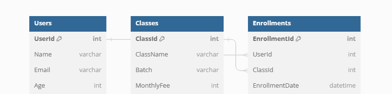

# Yoga Enrollment Application

## Project Overview

Yoga Enrollment is a full-stack web application designed to facilitate the enrollment of users into various yoga classes. It features a user-friendly interface for class selection and enrollment management, along with a robust backend for handling data storage and retrieval.

## Features

- **User Registration**: Users can register with their details including name and age.
- **Class Selection**: Users can choose from various yoga classes at different times.
- **Enrollment Management**: Users can enroll in classes and view their enrollment status.
- **Monthly Fee Indication**: Displays the monthly fee for each class.

## Technology Stack

- **Frontend**: React.js
- **Backend**: Node.js with Express
- **Database**: MongoDB
- **Deployment**: Frontend on Netlify, Backend on Horeku (Currently out of service)

## Getting Started

### Prerequisites

- Node.js
- npm or yarn
- Git
- MongoDB account (for the database)

### Installation

1. **Clone the repository:**

   ```sh
   git clone https://github.com/your-github-username/yoga-enrollment.git
   cd yoga-enrollment
   ```

2. **Set up the Backend:**

   - Navigate to the `yoga-backend` directory:

     ```sh
     cd yoga-backend
     ```

   - Install dependencies:

     ```sh
     npm install
     ```

   - Create a `.env` file and add your MongoDB connection string and other environment variables:

     ```env
     DATABASE_URL=******
     ```

   - Run the backend server:

     ```sh
     npm start
     ```

3. **Set up the Frontend:**

   - Navigate to the `yoga-admission-form` directory in a separate terminal window:

     ```sh
     cd yoga-admission-form
     ```

   - Install dependencies:

     ```sh
     npm install
     ```

   - Run the React development server:

     ```sh
     npm start
     ```

   - The application should now be running on `http://localhost:3000`.

## Deployment

- **Frontend Deployment on Netlify**: The frontend is deployed on Netlify with continuous deployment from the GitHub repository.
- **Backend Deployment on AWS Elastic Beanstalk**: The backend API is deployed on Horeku.

## Database Design

The application uses MongoDB for data storage. Below is the Entity Relationship (ER) diagram illustrating the database schema:



### Tables / Collections

- **Users**: Stores user information.
- **Classes**: Contains details about yoga classes.
- **Enrollments**: Tracks user enrollments in classes.

## Contact

- Your Name - Moulik Arora, Btech (IT)
- Project Link: [https://github.com/your-github-username/yoga-enrollment](https://github.com/Moulik07/Yoga-Enrollment)https://github.com/Moulik07/Yoga-Enrollment
